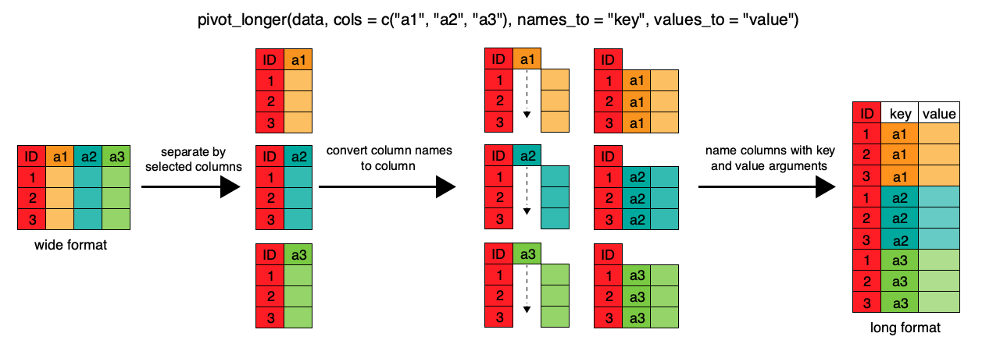

# Exercise 0: set the working directory

# Exercise 1: reading tables
Let's start by reading our first table from a file.  First, use _bash_ to check
the header of the file located in:

```bash
intro-r/raw/raw_drugs.csv
```
The **.csv** suffix stands for _comma separated file_. Even If the file ends in
_csv_, try to guess the **field separator** of your table. Sometimes, tables separated by **tab** instead of **comma**
are saved as _CSV_ nonetheless.

**Do you notice anything unusual in the contents of the file?**

<details>
  <summary>Answer</summary>
Yes, there are three lines starting with hashes, which explain the meaning
of each column, but are not part of the table itself.
</details>


Now that you know the **field separator** of your table, try to parse it using R
with the function:

```R
read.csv() 
```

Load the table as **messy** in R. **DO NOT** remove the hashes of the file beforehand. Instead, read the documentation
of `read.csv()` and try to find the parameter to skip the header. 

<details>
  <summary>Answer</summary>
```R
messy <- read.csv('raw/raw_drugs.csv', skip=3)
```
</details>


# Exercise 2: reading tables with readr
Read the table a second time, now using the function `read_csv` from the _tidyverse_
package _readr_. This time, call the table **messy_readr**. 

<details>
  <summary>Answer</summary>
```R
messy_readr <- readr::read_csv('raw/raw_drugs.csv', skip=3)
```
</details>

**Check the class** of both **messy** and **messy_readr**. Remember that in R, you
can do this using ```class()```.

**Questions**:
1. Are you getting the same results for both tables?
1. Print both tables to the screen. Do you get the same output?
1. Can you convert **messy_readr** to a `data.frame()`. How?

<details>
  <summary>Answers</summary>
1. No. The first one is a data.frame and the second one (coming from readr) is a tibble.
1. No. The second table reports the data type of each column.
1. Yes. Using `as.data.frame()`.
</details>

# Exercise 3: fixing the columns with pivot_longer
Now that we have our **messy** data frame loaded, we are ready to start fixing it. It is
clear that some important observations are stored as column names: the type of drug
administered to each patient AND the day when the heart rate was measured. Notice that,
despite **heart rate** being the main variable of the study, it is not mentioned **anywhere**
in the column names. We have to fix that.

**Copy and paste the following code**

```R
fixed <- pivot_longer(data=messy,
                      cols=drug_a_1:drug_b_3,
                      names_sep = '_',
                      names_to = c('drug', 'drug_type', 'day'),
                      values_to = 'heart_rate')
```

Run it and print the resulting **fixed** table. 

Now, **answer the following questions**:

1. How many columns does **fixed** have?
1. What do you think the name of **pivot_longer** stands for?
1. Do you see any advantages of this table format over the original one?
1. Try to subset **fixed**. Select **Sandra** AND **drug A** AND **day 3**.
1. Can you perform the previous subset on **messy**? Why?

<details>
  <summary>Answers</summary>
1. 5. 
1. It means that the resulting table will be **longer**: i.e. it will have more rows and less columns than before.
1. It is clearer and allows for much better subsetting. 
1. With the following code:

```R
is_Sandra <- fixed$name == 'Sandra'
is_drug_a <- fixed$drug_type == 'a'
is_day_3  <- fixed$day == 3

combined_logic <- is_Sandra & is_drug_a & is_day_3

subset_sandra <- fixed[combined_logic,]
```

As for the last question, it is simply **imposibble** because most of the information
is stored as column names. Therefore, you have to read each column and find the most fitting.
</details>


# Understanding pivot longer


_Image taken from: https://hbctraining.github.io/Intro-to-R/lessons/08_intro_tidyverse.html_

**Pivot longer** is one of the **most useful** transformations when dealing with tables. It is also
**one of the most** difficult to understand. Take your time now to reflect about the previous exercise
and ask any questions you may have. We'll come back to `pivot_longer` soon.


# Exercise 4: changing column types
If we take a closer look at the columns **name**, **drug_type** and **day**, you'll
notice that the value itself is not important. These are labels of a group. However,
at this moment, each of these columns is coded as **character** _<chr>_  

Moreover, the column **drug** has only one `unique` value, and thus it is unnecessary. 
We have to remove it.

To fix these issues:

1. Change the column type of **name**, **drug_type** and **day** to the most fitting in each case.
1. Remove the column **drug**.

**CLUE**: One way to remove a column is to select every column but the one you want to remove and 
subset the data frame.

<details>
  <summary>Answers</summary>

```R
fixed$name      <- as.factor(fixed$name)
fixed$drug_type <- as.factor(fixed$drug_type)

fixed$day <- as.factor(fixed$day)

## This one is also valid in SOME contexts
fixed$day <- as.numeric(fixed$day)

## Getting rid of column
fixed <- fixed[,c('name', 'drug_type', 'day', 'heart_rate')]
```

</details>

# Exercise 5: Mutating and selecting: the tidy way
The previous exercise can be done using functions from the **tidyverse**. In this case,
we are going to learn about `mutate()` and `select`.

1. Read the documentation for `mutate()` and use it to set the columns **name**, **drug_type**
and **day** to **factor**.
1. Use `select()` to get rid of the **drug** column. Try **NOT TO** do it by subsetting the rest of the columns.


<details>
  <summary>Answers</summary>

```R
    fixed <- mutate(fixed, name = as.factor(name), drug_type = as.factor(drug_type), day = as.factor(day))
    fixed <- select(fixed, -drug)
```

</details>


# Exercise 6: filtering: the tidy way

Before, we used subsetting to select certain rows and columns from our table.
Now, we are going to use the function `filter()` from the package **dplyr**. First, take
a look at the documentation and then:

1. Use `filter()` to select _Alfredo_ from **name** and _b_ from **drug_type**.
1. Use `filter()` to select all rows where **heart_rate** is GREATER than 89 OR LESS than 55.
1. Take a closer look at the documentation. What happens If you try to filter the table by two conditions without any logic operator?

<details>
  <summary>Answers</summary>

```R
alfredo_filtered <- filter(fixed, name == 'Alfredo' & drug_type == 'b')
heart_rates      <- filter(fixed, heart_rate > 89 | heart_rate < 55)
```

If you filter without any logical operator, It will assume you are using 
AND (&).
</details>

# Exercise 7: making groups and performing statistics

Look at the following code and try to guess what's happening. You may use the
documentation to read about the function `group_by()`. 

```R

fixed_groups  <- group_by(fixed, drug_type)
fixed_summary <- summarise(fixed_groups, mean_heart_rate=mean(heart_rate))

```

<details>
  <summary>Answers</summary>

`group_by` makes a **grouped tibble**, an object on which we can perform statistics
on each group at a time. In this case, we grouped or tibble by **drug_type** and  thus
we got **two groups**, one for each **level** of the factor **drug_type**. 

Then, we  used `summarise`, which creates a new data frame with one or more rows,
depending on the combination of grouping variables. It also adds a column for each
statistics we requested. In this case, we got a column called **mean_heart_rate**,
storing the average heart_rate by drug. 
</details>

# Exercise 8: More grouping and summaries
Using the previous exercise as an example: 

1. Group the data frame **fixed** by **day** AND **drug_type**.
1. Calculate the **mean** and the **standard deviation** of the _heart rate_ by these grouping variables.

<details>
  <summary>Answers</summary>

```R

double_grouping      <- group_by(fixed, day, drug_type)
fixed_summary_double <- summarise(double_grouping, mean_heart_rate=mean(heart_rate), standard_deviation=sd(heart_rate))

```
</details>

# Exercise 9: Introducing the pipe!
Up until now, we have been filtering, grouping and summarising one step at a time.
However, **dplyr** offers a new operator, `%>%`, that allows us to code pipes. These
pipes allow us to concatenate data frames operations without saving the intermediate
data. 

For instance: 

```R

final_summary <- messy %>% # First PIPE!
    pivot_longer(cols=drug_a_1:drug_b_3,
                 names_sep = '_',
                 names_to = c('drug', 'drug_type', 'day'),
                 values_to = 'heart_rate') %>%  # SECOND PIPE!
    mutate(name = as.factor(name),
           drug_type = as.factor(drug_type),
           day = as.factor(day)) %>% ## Another pipe
    group_by(drug_type) %>% ## last pipe
    summarise(mean_rate = mean(heart_rate), standard_dev = sd(heart_rate))

print(final_summary)
```

**Copy and paste** the aforementioned code and look at the results. It starts
from **messy**, the original data frame we loaded, and then:

1. The code sends the whole data frame (messy) to **pivot_longer**.
1. In this case, we do not tell **pivot_longer** that `data=messy`. That's because we are already sending
**messy** to the function as part of the pipe.
1. Once `pivot_longer()` finishes, we send the result to the next function: `mutate`.
1. Again, in `mutate()` we do not set any data frame as argument. Instead, we are using the result from `pivot_longer()`.
1. `mutate()` creates new columns using previous one. In this case, our new columns have the same names as the old ones, but
they are now factors.
1. Then, after `mutate()`, we send the result again to another function, in this case, `group_by()`.
1. `group_by()` simply groups the data frame by **drug_type** and sends the results to `summarise()`.
1. `summarise()` creates a new data frame as in the previous exercise.

